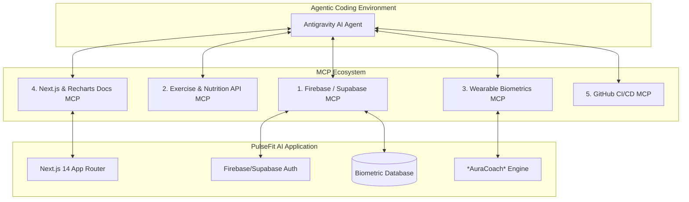

# PulseFit AI - MCP Servers & Agentic Architecture Guide 🚀

This document details the **Model Context Protocol (MCP)** server architecture recommended for accelerating the development of **PulseFit AI**—an AI-powered Next.js fitness web application with a 3-tier subscription system (Free, Plus, Pro), biometric data visualizers, and an autonomous AI Coaching Agent (*AuraCoach*).

---

## 1. Overview of MCP in PulseFit AI Development

Model Context Protocol (MCP) servers act as standardized bridges connecting AI coding agents to external databases, authentication providers, fitness/nutrition APIs, wearable biometric feeds, and framework documentation.



---

## 2. Recommended MCP Servers Breakdown

### 🗄️ 1. Firebase / Supabase Database & Auth MCP Server
* **Purpose**: Automates backend database schema creation, real-time data synchronization, security rules management, and user authentication.
* **Why it makes development easier**:
  * Eliminates writing tedious SQL/NoSQL schema migrations manually.
  * Auto-generates type-safe TypeScript interfaces for `UserProfile`, `WorkoutLogs`, `GymStreak`, and `BiometricData`.
  * Configures secure role-based access control (RBAC) to enforce **Free**, **Plus**, and **Pro** feature access rules.

### 🥗 2. Exercise & Nutrition Data MCP Server (Fetch / API MCP)
* **Purpose**: Fetches real-world, verified nutrition data from public APIs (e.g., USDA FoodData Central, Open Food Facts) and exercise biomechanics catalogs.
* **Why it makes development easier**:
  * Seeds realistic macronutrient databases (Proteins, Carbs, Fats, Micronutrients) for the **Plus Tier AI Diet Engine**.
  * Pulls standardized exercise mechanics, target muscle groups, and movement safety cues for compound lifts (Squat, Deadlift, Bench Press).

### ⌚ 3. Wearable Biometrics API MCP Server (HealthKit / Garmin / Strava Mock MCP)
* **Purpose**: Simulates or connects live biometric streams (Heart Rate Variability - HRV, Resting Heart Rate, Sleep Quality Scores, Daily Step Counts).
* **Why it makes development easier**:
  * Injects real-time recovery data directly into the **Pro Tier Biometric Dashboard**.
  * Provides live test feeds so the autonomous **AuraCoach AI Agent** can test load adjustments (RPE ratings) and recovery prompts under different stress levels.

### 📚 4. Framework & Visualization Docs MCP Server (Next.js & Recharts Docs MCP)
* **Why it makes development easier**:
  * Grants instant semantic access to Next.js 14 App Router specifications (Server Components, Client Components, Server Actions).
  * Provides zero-bug chart implementation patterns for Recharts canvas elements (multi-axis trend graphs for Body Fat %, Muscle Mass, and Sleep cycles).

### 🐙 5. GitHub & CI/CD Lifecycle MCP Server
* **Purpose**: Manages repository operations, automated commit logging per Agile Sprint, pull requests, and automated deployment triggers.
* **Why it makes development easier**:
  * Keeps the codebase cleanly organized according to our 5-Sprint Agile Roadmap.

---

## 3. How MCP Accelerates Each Subscription Tier Development

| Subscription Tier | Feature Set | Supporting MCP Server | Accelerated Outcome |
| :--- | :--- | :--- | :--- |
| **Free Tier** 🆓 | BMR / TDEE Calculators & General Workout Catalog | Exercise & Nutrition MCP | Instant access to verified metabolic formulas and standardized exercise execution guidance. |
| **Plus Tier** ⚡ | AI Goal Blueprint, Dynamic AI Workout & Meal Engine, Gym Streak | Database & Auth MCP | Automated user profile persistence, streak heatmap calculations, and instant custom routine generation. |
| **Pro Tier** 👑 | Biometric Canvas Charts, Sleep Recovery, Wearable Insights, AuraCoach RPE Engine | Wearable Biometrics MCP + Framework Docs MCP | Effortless Recharts integration and automated AI readiness score adjustments based on live biometric feeds. |

---

## 4. Setup & Integration Instructions

To enable these MCP servers in your local environment, add the following configuration to your MCP config file (`mcp_config.json`):

```json
{
  "mcpServers": {
    "firebase-supabase": {
      "command": "npx",
      "args": ["-y", "@modelcontextprotocol/server-supabase"]
    },
    "fetch-nutrition": {
      "command": "npx",
      "args": ["-y", "@modelcontextprotocol/server-fetch"]
    },
    "git-lifecycle": {
      "command": "npx",
      "args": ["-y", "@modelcontextprotocol/server-github"]
    }
  }
}
```

---

*This guide serves as the technical architecture companion to the main `PULSEFIT_AI_PLAN.md`.*
