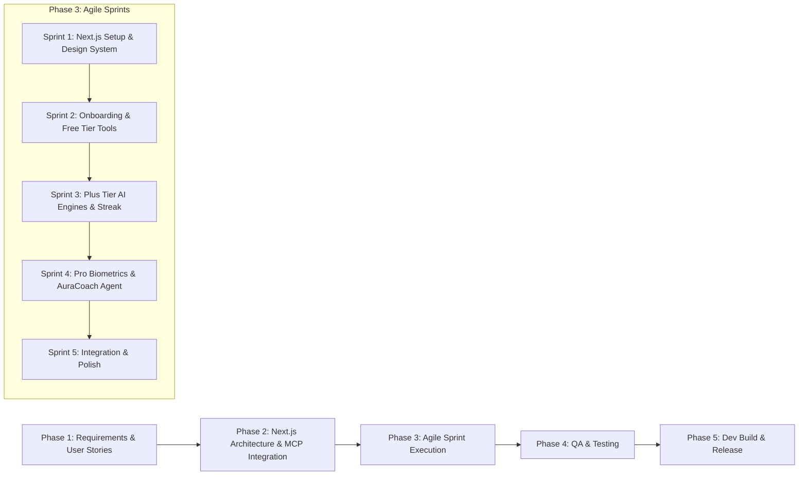

# SDLC Implementation Plan - PulseFit AI (Next.js Agile Framework)

**PulseFit AI** is an AI-powered fitness and biometric intelligence web application built with **Next.js (App Router)**, React, and TypeScript/JavaScript. It features a 3-tier subscription model (Free, Plus, Pro), multi-step health onboarding, interactive biometric charts, and an autonomous AI Coaching Agent (*AuraCoach*).

---

## 1. Tech Stack & Framework Architecture

* **Framework**: **Next.js 14+ (App Router)**
* **Language**: TypeScript / JavaScript (React components)
* **Styling**: Tailwind CSS + Custom CSS Variables for Glassmorphism & Cyber Aesthetics (`#0B0F19` slate background, `#6366F1` indigo, `#10B981` emerald, `#F59E0B` amber)
* **Data Visualization**: Recharts / Chart.js for responsive interactive biometric graphs
* **Icons**: `lucide-react`
* **State Management & Persistence**: React Context / Hooks + LocalStorage / Database persistence
* **Project Directory**: `C:\Users\patel\.gemini\antigravity\scratch\pulsefit-ai`

---

## 2. SDLC Life Cycle & Agile Framework



---

## 3. Recommended MCP Servers for Rapid Development

Integrating Model Context Protocol (MCP) servers accelerates the development of PulseFit AI by connecting our agentic workflow directly to external data sources, databases, documentation, and fitness APIs.

### 1. 🗄️ Database & Auth MCP Server (Firebase / Supabase MCP)
* **Why it helps**: Automates database schema management, user authentication setup, security rules, and real-time syncing for fitness logs, gym streaks, and subscription statuses without writing repetitive boilerplate code.
* **Capabilities**:
  * Create & seed exercise tables and meal plan collections.
  * Audit security rules for user biometric privacy.
  * Manage user authentication roles (Free, Plus, Pro).

### 2. 🥗 Nutrition & Exercise Data MCP Server (Fetch / Web Search / API MCP)
* **Why it helps**: Instantly fetches verified caloric and macronutrient data from public sources (USDA FoodData Central, Open Food Facts) and exercise biomechanics databases.
* **Capabilities**:
  * Populate realistic macro databases (Protein, Carbs, Fats, Micronutrients).
  * Pull standardized exercise instructions, targeted muscle groups, and movement biomechanics for compound lifts.

### 3. ⌚ Wearable Biometrics API MCP Server (Health / Wearable Mock MCP)
* **Why it helps**: Connects the AI agent to wearable data streams (simulated or real APIs like Apple HealthKit, Garmin, Strava, or Google Health Connect) to feed *AuraCoach*.
* **Capabilities**:
  * Inject Heart Rate Variability (HRV), Resting Heart Rate, and Sleep Efficiency data into the biometric dashboard.
  * Trigger real-time readiness adjustments when HRV drops or sleep score is low.

### 4. 📚 Framework Documentation MCP Server (Next.js & Recharts Docs MCP)
* **Why it helps**: Provides up-to-date documentation on Next.js 14 App Router features (Server Actions, Suspense, Middleware) and Recharts/Chart.js syntax for zero-bug chart implementation.
* **Capabilities**:
  * Instant access to responsive chart container patterns, glassmorphism CSS snippets, and Next.js routing patterns.

---

## 4. Component Architecture & Next.js Structure

```
pulsefit-ai/
├── src/
│   ├── app/
│   │   ├── layout.tsx         # Root layout with Dark Theme & Font imports
│   │   ├── page.tsx           # Main Landing / App Shell
│   │   ├── globals.css        # Global CSS & Glassmorphism design tokens
│   │   └── api/               # API routes for AI & Biometrics
│   ├── components/
│   │   ├── Header.tsx         # Navbar & Live Tier Switcher Sandbox
│   │   ├── OnboardingWizard.tsx # Multi-step questionnaire modal/flow
│   │   ├── FreeCalculators.tsx  # BMR & TDEE calculators
│   │   ├── WorkoutLibrary.tsx   # Free & Plus workout plan catalog
│   │   ├── AIGoalBlueprint.tsx  # Plus Tier: Custom timeline & targets
│   │   ├── AIDietEngine.tsx     # Plus Tier: AI Meal & Macro generator
│   │   ├── AIWorkoutEngine.tsx  # Plus Tier: Dynamic routine builder
│   │   ├── GymStreakTracker.tsx # Plus Tier: Heatmap & habits
│   │   ├── BiometricDashboard.tsx # Pro Tier: Recharts for Fat %, Muscle, Weight
│   │   ├── SleepRecoveryTracker.tsx # Pro Tier: Sleep breakdown & Readiness Score
│   │   ├── AuraCoachAgent.tsx   # Pro Tier: RPE load adjuster & injury regressions
│   │   └── CoachAuraChat.tsx    # Pro Tier: Floating AI Coach Assistant Drawer
│   ├── context/
│   │   └── AppContext.tsx     # Global state: User profile, Tier, Biometrics, Logs
│   └── lib/
│       ├── calculations.ts    # BMR, TDEE, Calorie Deficit/Surplus formulas
│       ├── aiGenerators.ts    # Workout, Diet & Goal algorithm generators
│       └── auraCoachEngine.ts # RPE adjustment & wearable insights logic
```

---

## 5. Agile Sprint Breakdown (Next.js Project)

#### 🚀 Sprint 1: Next.js Initialization & Core Design System (Days 1–2)
* Initialize Next.js app in non-interactive mode using `create-next-app` in `pulsefit-ai`.
* Configure Tailwind CSS and custom glassmorphism design tokens in `globals.css`.
* Build `AppContext.tsx` for state management and local storage persistence.
* Construct responsive Header, Footer, and live **Tier Switcher Pill** (Free / Plus / Pro).

#### 📋 Sprint 2: Onboarding Wizard & Free Tier Components (Days 3–4)
* Build `OnboardingWizard.tsx` (6-step interactive questionnaire).
* Build `FreeCalculators.tsx` with live Mifflin-St Jeor BMR & TDEE calculation visualizers.
* Build `WorkoutLibrary.tsx` with filterable exercise splits and form tips.

#### ⚡ Sprint 3: Plus Tier AI Engines & Habit Heatmap (Days 5–6)
* Build `AIGoalBlueprint.tsx` (target weight timeline and calorie deficit/surplus engine).
* Build `AIWorkoutEngine.tsx` (dynamic routine generator based on equipment, goals, experience).
* Build `AIDietEngine.tsx` (custom macro splits & sample meal menus).
* Build `GymStreakTracker.tsx` (visual workout log calendar and habit streaks).

#### 👑 Sprint 4: Pro Tier Biometric Intelligence & AuraCoach Agent (Days 7–8)
* Build `BiometricDashboard.tsx` with Recharts (Body Fat %, Muscle Mass, Weight progress over time).
* Build `SleepRecoveryTracker.tsx` (Deep/REM sleep, 0–100 Biometric Readiness Index).
* Build `AuraCoachAgent.tsx` (RPE load auto-adjuster, injury regressions, wearable insights).
* Build `CoachAuraChat.tsx` (floating AI coach drawer).

#### 🧪 Sprint 5: System Testing & Development Server Run (Days 9–10)
* Test state flow across onboarding, tier switching, and biometric logs.
* Verify mobile/desktop layouts and smooth glassmorphism rendering.
* Run Next.js local development server (`npm run dev`) and verify zero build errors.

---

## 6. Verification Plan

### Automated / Build Verification
- Run `npm run build` or `npm run dev` to verify Next.js compiles cleanly without TypeScript or React lint errors.
- Test formula calculations in `lib/calculations.ts`.

### Manual Verification
1. Walk through the Next.js Onboarding Wizard.
2. Toggle Tier Switcher between **Free**, **Plus**, and **Pro** to verify Next.js component gating.
3. Test interactive biometric charts and log updates.
4. Interact with *AuraCoach* RPE load scaling sliders and verify instant routine adjustments.
